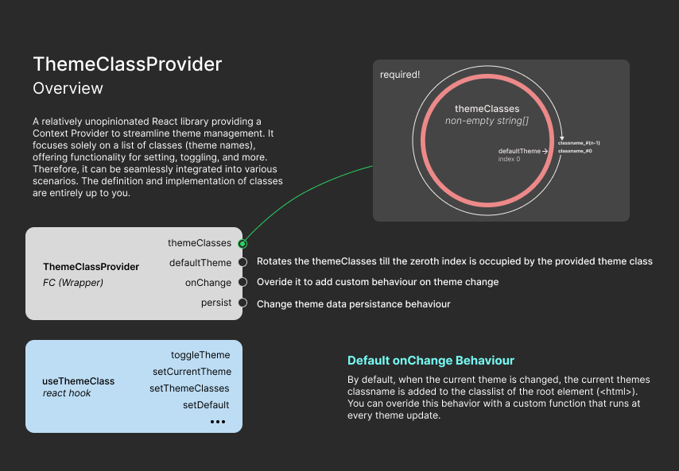

# theme-class-provider

theme-class-provider is a React library that provides a ThemeProvider based on a list of classes provided.



## Installation

You can install theme-class-provider using npm or yarn:

```bash
npm install theme-class-provider
# or
yarn add theme-class-provider
```

## Usage

To use theme-class-provider, you need to wrap your application with the ThemeClassProvider component provided by the library. Here's how you can do it:

```jsx
import React from "react";
import ReactDOM from "react-dom";
import { ThemeClassProvider } from "theme-class-provider";
import App from "./App";

const themeClasses = ["theme-light", "theme-dark"];

ReactDOM.render(
    <ThemeClassProvider themeClasses={themeClasses}>
        <App />
    </ThemeClassProvider>,
    document.getElementById("root")
);
```

<p>In the example above, **themeClasses** is an array of class names representing different themes. You can customize this array based on your application's requirements.</p>

<p>To access the theme context within your components, you can use the useThemeClass hook provided by the library:
</p>

```jsx
import React from "react";
import { useThemeClass } from "theme-class-provider";

const MyComponent = () => {
    const { getCurrentTheme, toggleTheme } = useThemeClass();

    const currentTheme = getCurrentTheme();

    return (
        <div className={currentTheme}>
            <button onClick={toggleTheme}>Toggle Theme</button>
            <p>Current Theme: {currentTheme}</p>
        </div>
    );
};

export default MyComponent;
```

## Contributing

Contributions are welcome! If you have any ideas, suggestions, or bug fixes, please open an issue or submit a pull request on [GitHub](https://github.com/sreed17/theme-class-provider.git).

## License

This project is licensed under the MIT License - see the [LICENSE](LICENSE) file for details.
